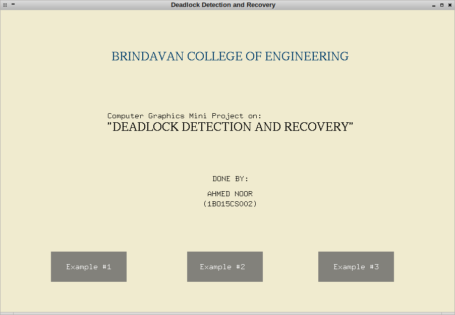
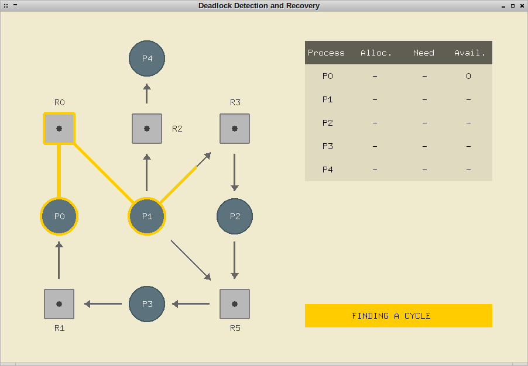
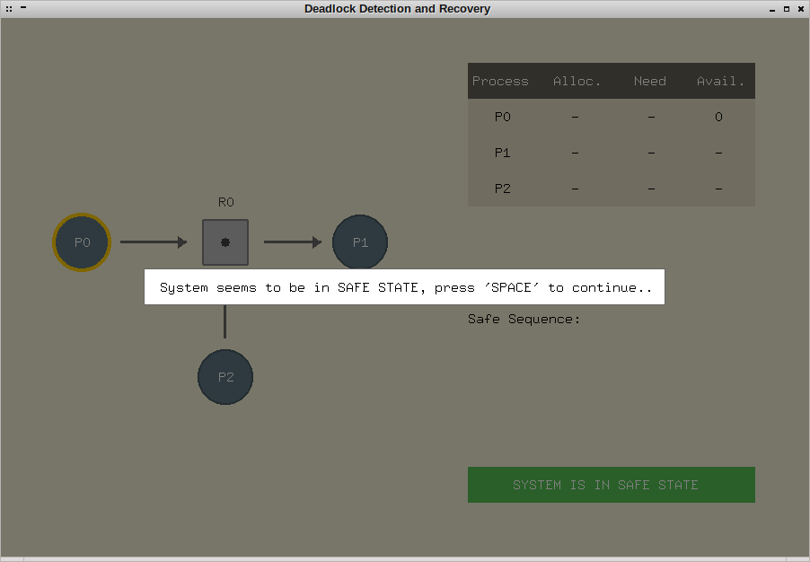
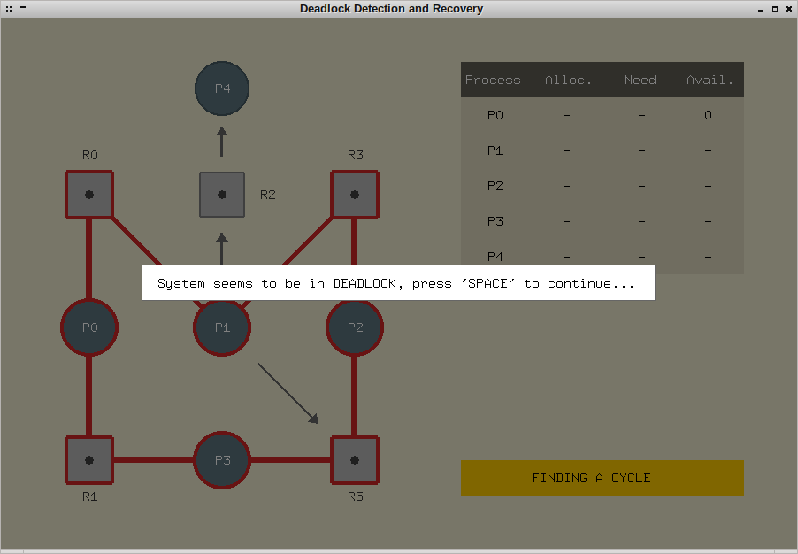
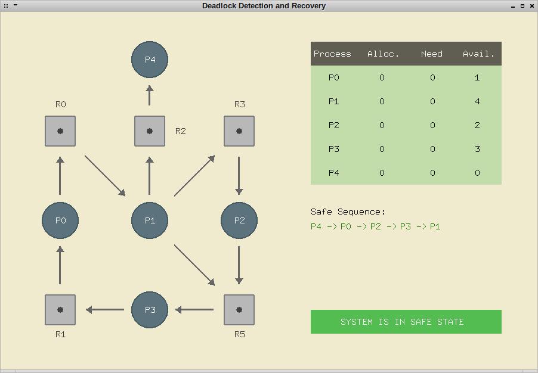
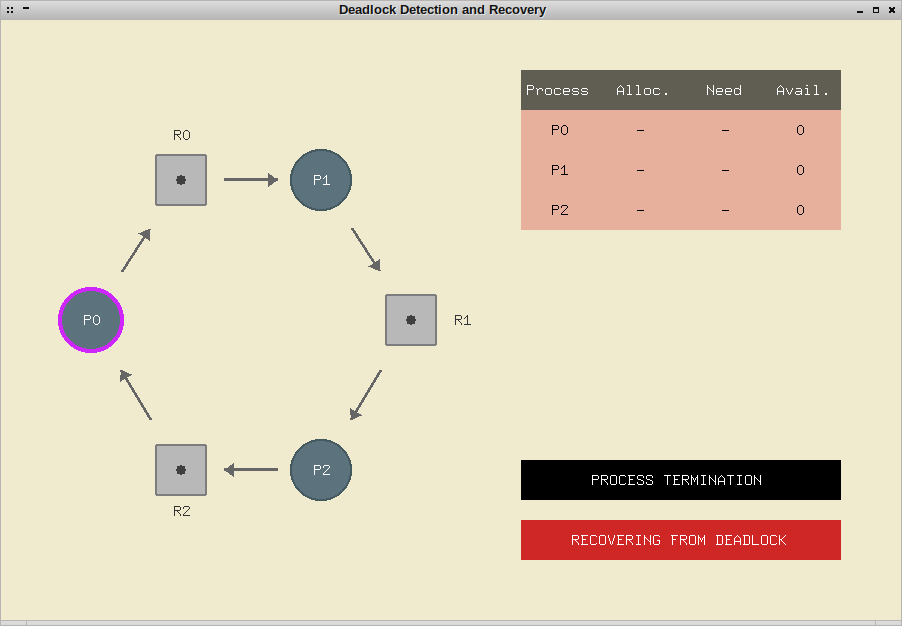
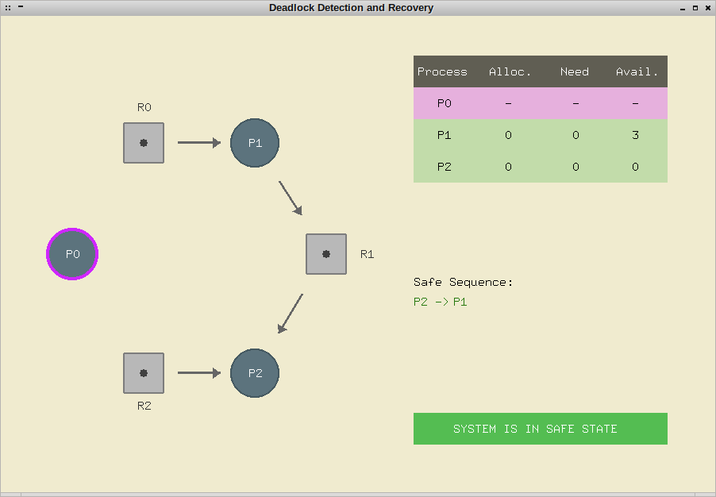

# Deadlock Recovery - Computer Graphics Project

## Setting up

  - Install required libraries:
	- `sudo apt-get update`
	- `sudo apt-get install libglu1-mesa-dev freeglut3-dev mesa-common-dev`
	
  - Compile the program:
  	- `g++ main.cpp -o main -lglut -lGLU -lGL`
    
  - Run application:
  	- `./main`
    
## Navigation

  - Click on an **"Example"** to execute.
  
  - Press ***Space*** to proceed with each step 
  	- *( **FINDING A CIRCLE** -> **BANKER's ALGORITHM** -> **PROCESS TERMINATION** )*
	
  - Press ***Esc*** to get back to the navigation screen.

## Screenshots

### Navigation Screen

### Finding a cycle

### Safe State (No cycle found)

### Cycle found

### Bankers Algorithm

### Process termination

### System Recovered

> The code was written in 3 days, so cut me some slack!
